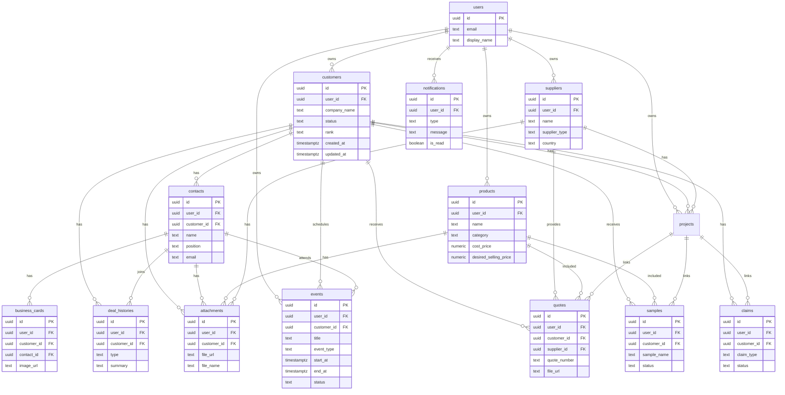
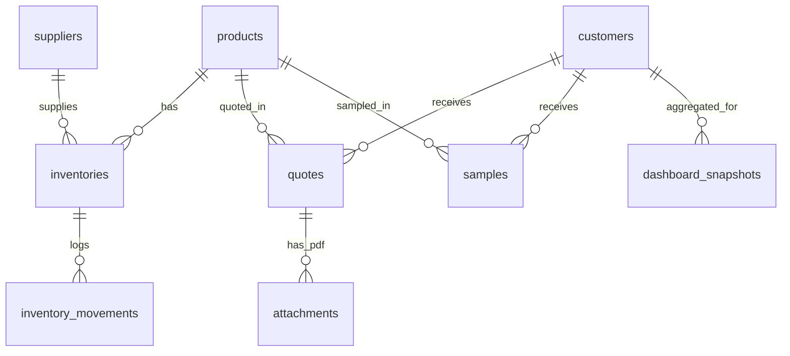

# DATABASE

営業手帳で使用するデータベース構造を管理する。

今後テーブルを追加・変更する場合は、この `DATABASE.md` を正として更新する。

## テーブル一覧

- customers
- contacts
- business_cards
- products
- suppliers
- projects
- quotes
- samples
- deal_histories
- claims
- attachments
- events
- notifications
- users

## ER図

## customers

- 目的: 取引先会社情報を管理する。
- 主キー: `id`
- 主要カラム: `user_id`, `company_name`, `formal_name`, `industry`, `area`, `address`, `phone`, `website`, `email`, `inquiry_url`, `status`, `rank`, `score`, `tags`, `company_note`, `next_follow_up_date`, `last_contact_date`, `is_do_not_contact`, `created_at`, `updated_at`
- 外部キー: `user_id -> users.id`
- 関連テーブル: `contacts`, `business_cards`, `deal_histories`, `quotes`, `samples`, `claims`, `attachments`, `events`, `notifications`
- Storage利用有無: なし
- RLS有無: あり。`auth.uid() = user_id`
- 検索対象項目: `company_name`, `formal_name`, `industry`, `area`, `address`, `phone`, `website`, `email`, `tags`, `company_note`
- 今後追加予定項目: `corporate_number`, `company_size`, `annual_sales`, `employee_count`, `decision_flow`, `credit_note`

## contacts

- 目的: 会社に紐づく担当者情報を管理する。
- 主キー: `id`
- 主要カラム: `user_id`, `customer_id`, `name`, `department`, `position`, `email`, `phone`, `mobile`, `has_decision_authority`, `position_score`, `memo`, `created_at`, `updated_at`
- 外部キー: `user_id -> users.id`, `customer_id -> customers.id`
- 関連テーブル: `customers`, `business_cards`, `deal_histories`, `quotes`, `samples`, `attachments`
- Storage利用有無: なし
- RLS有無: あり。`auth.uid() = user_id`
- 検索対象項目: `name`, `department`, `position`, `email`, `phone`, `mobile`, `memo`
- 今後追加予定項目: `line_id`, `preferred_contact_method`, `birthday`, `influence_level`

## business_cards

- 目的: 名刺画像とOCR結果を管理する。
- 主キー: `id`
- 主要カラム: `user_id`, `customer_id`, `contact_id`, `image_url`, `file_name`, `ocr_text`, `parsed_name`, `parsed_company`, `parsed_department`, `parsed_position`, `parsed_email`, `parsed_phone`, `created_at`, `updated_at`
- 外部キー: `user_id -> users.id`, `customer_id -> customers.id`, `contact_id -> contacts.id`
- 関連テーブル: `customers`, `contacts`, `attachments`
- Storage利用有無: あり。名刺画像をSupabase Storageに保存する。
- RLS有無: あり。`auth.uid() = user_id`
- 検索対象項目: `ocr_text`, `parsed_name`, `parsed_company`, `parsed_department`, `parsed_position`, `parsed_email`, `parsed_phone`
- 今後追加予定項目: `ocr_provider`, `ocr_confidence`, `reviewed_at`, `reviewed_by`

## products

- 目的: 商品マスターを管理する。
- 主キー: `id`
- 主要カラム: `user_id`, `name`, `category`, `manufacturer_name`, `origin`, `temperature_zone`, `package_style`, `cost_price`, `cost_unit`, `desired_selling_price`, `selling_price_unit`, `gross_margin_rate`, `description`, `memo`, `image_url`, `product_material_url`, `spec_sheet_url`, `tags`, `created_at`, `updated_at`
- 外部キー: `user_id -> users.id`
- 関連テーブル: `quotes`, `samples`, `attachments`
- Storage利用有無: あり。商品画像、商品資料、スペックシートをSupabase Storageに保存する。
- RLS有無: あり。`auth.uid() = user_id`
- 検索対象項目: `name`, `category`, `manufacturer_name`, `origin`, `temperature_zone`, `package_style`, `description`, `memo`, `tags`
- 今後追加予定項目: `jan_code`, `allergen_info`, `shelf_life`, `inventory_link_id`, `supplier_product_code`

## suppliers

- 目的: 国内仕入先と海外メーカー情報を管理する。
- 主キー: `id`
- 主要カラム: `user_id`, `name`, `country`, `supplier_type`, `contact_person`, `email`, `phone`, `website`, `products`, `incoterms`, `loading_port`, `currency`, `moq`, `lead_time`, `payment_terms`, `temperature_zone`, `tags`, `memo`, `created_at`, `updated_at`
- 外部キー: `user_id -> users.id`
- 関連テーブル: `quotes`, `products`, `attachments`
- Storage利用有無: なし
- RLS有無: あり。`auth.uid() = user_id`
- 検索対象項目: `name`, `country`, `supplier_type`, `contact_person`, `email`, `phone`, `website`, `products`, `incoterms`, `loading_port`, `currency`, `memo`, `tags`
- 今後追加予定項目: `factory_certifications`, `export_license`, `lead_time_note`, `quality_contact`, `sample_policy`

## projects

- 目的: 1つの取引先または仕入先に複数の営業案件・仕入案件を紐付け、商談、見積、サンプル、クレーム、予定、担当者を案件単位で管理する。
- 主キー: `id`
- 主要カラム: `user_id`, `title`, `customer_id`, `supplier_id`, `contact_ids`, `type`, `status`, `priority`, `owner_user_id`, `product_ids`, `product_proposals`, `inventory_ids`, `quote_ids`, `sample_ids`, `complaint_ids`, `start_date`, `expected_close_date`, `next_action_date`, `expected_sales`, `expected_gross_profit`, `expected_operating_profit`, `memo`, `created_by`, `created_at`, `updated_at`
- 外部キー: 現時点では既存互換のためID文字列で保持。将来 `customers.id`, `suppliers.id`, `contacts.id`, `products.id`, `inventories.id`, `quotes.id`, `samples.id`, `claims.id` へ外部キー化を検討する。
- 関連テーブル: `customers`, `suppliers`, `contacts`, `products`, `inventories`, `quotes`, `samples`, `claims`, `events`, `attachments`
- Storage利用有無: なし。案件添付は `attachments.project_id` または `owner_type = project` でStorage URLのみ保持する。
- RLS有無: あり。`auth.uid() = user_id`
- 検索対象項目: `title`, `type`, `status`, `priority`, `memo`, 関連する取引先名、仕入先名
- 今後追加予定項目: `lost_reason`, `probability`, `actual_sales`, `actual_gross_profit`, `actual_operating_profit`, `closed_at`, `updated_by`, `updated_by_name`

### projects.product_proposals

- 目的: 案件単位で複数商品の提案・採用進捗、見込数量、想定売価、原価、利益、採用/不採用理由、競合商品を管理する。
- 保存形式: `jsonb` 配列。1要素は `id`, `productId`, `status`, `monthlyExpectedQuantity`, `annualExpectedQuantity`, `unit`, `expectedSellingPrice`, `expectedCost`, `expectedExpense`, `expectedGrossProfit`, `expectedOperatingProfit`, `expectedRealProfit`, `reasonCategory`, `adoptionReason`, `rejectionReason`, `competitorProduct`, `memo`, `createdAt`, `updatedAt` を持つ。
- 関連テーブル: `projects`, `products`
- RLS有無: `projects` のRLSに従う。

## quotes

- 目的: 顧客への見積履歴と関連ファイルを管理する。
- 主キー: `id`
- 主要カラム: `user_id`, `customer_id`, `supplier_id`, `product_ids`, `contact_ids`, `quote_number`, `submitted_date`, `valid_until`, `currency`, `total_amount`, `gross_margin_rate`, `status`, `file_url`, `file_name`, `memo`, `lost_reason`, `created_by`, `created_by_name`, `created_at`, `updated_at`
- 外部キー: `user_id -> users.id`, `customer_id -> customers.id`, `supplier_id -> suppliers.id`
- 関連テーブル: `customers`, `suppliers`, `products`, `contacts`, `attachments`, `notifications`
- Storage利用有無: あり。見積PDFや関連資料をSupabase Storageに保存する。
- RLS有無: あり。`auth.uid() = user_id`
- 検索対象項目: `quote_number`, `status`, `file_name`, `memo`, `lost_reason`, `created_by_name`
- 今後追加予定項目: `approval_status`, `approved_by`, `sent_at`, `mail_log_id`, `revision_number`

## samples

- 目的: サンプル発送、到着、評価、採用状況を管理する。
- 主キー: `id`
- 主要カラム: `user_id`, `customer_id`, `contact_ids`, `product_ids`, `sample_name`, `shipped_date`, `arrival_date`, `follow_up_date`, `status`, `feedback`, `next_action`, `shipping_method`, `tracking_number`, `memo`, `created_by`, `created_by_name`, `created_at`, `updated_at`
- 外部キー: `user_id -> users.id`, `customer_id -> customers.id`
- 関連テーブル: `customers`, `contacts`, `products`, `notifications`, `attachments`
- Storage利用有無: なし。必要に応じて関連資料は `attachments` で管理する。
- RLS有無: あり。`auth.uid() = user_id`
- 検索対象項目: `sample_name`, `status`, `feedback`, `next_action`, `shipping_method`, `tracking_number`, `memo`, `created_by_name`
- 今後追加予定項目: `temperature_condition`, `delivery_company`, `adoption_id`, `sample_cost`, `sample_quantity`

## deal_histories

- 目的: 商談履歴を監査ログとして管理する。
- 主キー: `id`
- 主要カラム: `user_id`, `customer_id`, `contact_ids`, `date`, `type`, `summary`, `next_action`, `created_by`, `created_by_name`, `companion_users`, `companion_names`, `replies`, `has_claim`, `created_at`, `updated_at`
- 外部キー: `user_id -> users.id`, `customer_id -> customers.id`
- 関連テーブル: `customers`, `contacts`, `quotes`, `samples`, `claims`, `attachments`
- Storage利用有無: なし。音声や資料は `attachments` で管理する。
- RLS有無: あり。`auth.uid() = user_id`
- 検索対象項目: `type`, `summary`, `next_action`, `created_by_name`, `companion_names`, `replies`
- 今後追加予定項目: `meeting_start_at`, `meeting_end_at`, `location`, `voice_file_url`, `ai_minutes_id`

## claims

- 目的: クレーム履歴と対応状況を管理する。
- 主キー: `id`
- 主要カラム: `user_id`, `customer_id`, `contact_ids`, `claim_type`, `content`, `occurred_date`, `status`, `cause`, `prevention`, `due_date`, `resolved_date`, `created_by`, `created_by_name`, `created_at`, `updated_at`
- 外部キー: `user_id -> users.id`, `customer_id -> customers.id`
- 関連テーブル: `customers`, `contacts`, `deal_histories`, `attachments`, `notifications`
- Storage利用有無: なし。証跡画像や資料は `attachments` で管理する。
- RLS有無: あり。`auth.uid() = user_id`
- 検索対象項目: `claim_type`, `content`, `status`, `cause`, `prevention`, `created_by_name`
- 今後追加予定項目: `severity`, `internal_owner`, `supplier_id`, `quality_report_url`, `recurrence_risk`

## attachments

- 目的: 顧客、担当者、商品、仕入先、商談、見積、クレームに紐づくファイルメタ情報を管理する。
- 主キー: `id`
- 主要カラム: `user_id`, `customer_id`, `contact_id`, `product_id`, `supplier_id`, `quote_id`, `sample_id`, `deal_history_id`, `claim_id`, `file_url`, `file_name`, `file_type`, `file_size`, `storage_path`, `uploaded_by`, `uploaded_by_name`, `uploaded_at`, `created_at`, `updated_at`
- 外部キー: `user_id -> users.id`, `customer_id -> customers.id`, `contact_id -> contacts.id`, `product_id -> products.id`, `supplier_id -> suppliers.id`, `quote_id -> quotes.id`, `sample_id -> samples.id`, `deal_history_id -> deal_histories.id`, `claim_id -> claims.id`
- 関連テーブル: `customers`, `contacts`, `products`, `suppliers`, `quotes`, `samples`, `deal_histories`, `claims`
- Storage利用有無: あり。ファイル本体はSupabase Storage、DBにはURLとメタ情報のみ保存する。
- RLS有無: あり。`auth.uid() = user_id`
- 検索対象項目: `file_name`, `file_type`, `uploaded_by_name`
- 今後追加予定項目: `preview_url`, `thumbnail_url`, `checksum`, `retention_policy`, `virus_scan_status`

## events

- 目的: カレンダー予定、商談予定、フォロー予定、延期・完了状態を管理する。
- 主キー: `id`
- 主要カラム: `user_id`, `title`, `event_type`, `customer_id`, `contact_ids`, `deal_id`, `location`, `start_at`, `end_at`, `all_day`, `priority`, `color`, `memo`, `next_follow_date`, `reminder`, `status`, `postponed_from_event_id`, `completed_at`, `created_by`, `created_by_name`, `created_at`, `updated_at`
- 外部キー: `user_id -> users.id`, `customer_id -> customers.id`
- 関連テーブル: `customers`, `contacts`, `deal_histories`, `notifications`
- Storage利用有無: なし。資料や画像は `attachments` で管理する。
- RLS有無: あり。`auth.uid() = user_id`
- 検索対象項目: `title`, `event_type`, `location`, `memo`, `status`, `created_by_name`
- 今後追加予定項目: `external_calendar_id`, `recurrence_rule`, `attendee_user_ids`, `reminder_sent_at`

## notifications

- 目的: ホーム画面に表示する通知や未対応タスクを管理する。
- 主キー: `id`
- 主要カラム: `user_id`, `customer_id`, `related_table`, `related_id`, `type`, `title`, `message`, `due_date`, `priority`, `is_read`, `created_at`, `updated_at`
- 外部キー: `user_id -> users.id`, `customer_id -> customers.id`
- 関連テーブル: `customers`, `quotes`, `samples`, `claims`, `deal_histories`
- Storage利用有無: なし
- RLS有無: あり。`auth.uid() = user_id`
- 検索対象項目: `type`, `title`, `message`, `priority`
- 今後追加予定項目: `snoozed_until`, `action_url`, `resolved_at`, `resolved_by`

## users

- 目的: Supabase Authユーザーに紐づくアプリ内プロフィールを管理する。
- 主キー: `id`
- 主要カラム: `id`, `email`, `display_name`, `avatar_url`, `role`, `created_at`, `updated_at`
- 外部キー: `id -> auth.users.id`
- 関連テーブル: `customers`, `contacts`, `business_cards`, `products`, `suppliers`, `quotes`, `samples`, `deal_histories`, `claims`, `attachments`, `events`, `notifications`
- Storage利用有無: あり。プロフィール画像を使用する場合のみSupabase Storageに保存する。
- RLS有無: あり。`auth.uid() = id`
- 検索対象項目: `email`, `display_name`, `role`
- 今後追加予定項目: `department`, `position`, `team_id`, `notification_settings`, `default_signature`

## 保存先

### Database

- 会社情報
- 担当者
- 商談
- 見積
- サンプル
- クレーム
- 予定

### Storage

- 商品画像
- 名刺画像
- 見積PDF
- 音声
- 添付資料

## 今後追加予定テーブル

- mail_logs
- line_logs
- ai_logs
- sales_reports
- inventory_links

---

## 追加: 受注管理 Phase 2

- 詳細仕様: `docs/SALES_ORDER_PHASE2.md`
- `sales_orders` 追加項目: `priority`, `reservation_status`, `reserved_total`, `shortage_total`
- `sales_order_lines` 追加項目: `reserved_quantity`, `shortage_quantity`, `reservation_status`
- `inventory_reservations` 追加項目: `sales_order_line_id`
- 引当は `reserve_sales_order_line_fefo`, `reserve_sales_order_line_lot`, `release_sales_order_line_reservations`, `reallocate_sales_order_line_fefo`, `reserve_sales_order_fefo`, `reserve_sales_orders_fefo` RPCで実行する。
- FEFO順は賞味期限、入庫日、作成日の順とし、期限切れ、隔離、使用可能在庫0、削除ロットは対象外とする。
- RLSは既存方針どおり `authenticated` かつ `auth.uid() = user_id` を維持する。

## Step26 追記: 在庫・見積PDF・営業データ集約

### 追加予定テーブル: inventories

- 目的: 商品ごとの在庫状態を管理する。
- 主キー: `id`
- 主要カラム:
  - `user_id`
  - `product_id`
  - `supplier_id`
  - `inventory_status`
  - `current_stock`
  - `reserved_stock`
  - `available_stock`
  - `reorder_point`
  - `unit`
  - `warehouse_location`
  - `lot_number`
  - `expiry_date`
  - `next_arrival_date`
  - `memo`
  - `created_by`
  - `created_at`
  - `updated_at`
- 外部キー:
  - `product_id` -> `products.id`
  - `supplier_id` -> `suppliers.id`
  - `user_id` -> `auth.users.id`
- 関連テーブル:
  - `products`
  - `suppliers`
  - `quotes`
  - `samples`
  - `adoptions`
- Storage利用有無: なし
- RLS有無: あり。`auth.uid() = user_id` のデータのみアクセス可能。
- 検索対象項目:
  - 商品名
  - 仕入先名
  - 在庫ステータス
  - ロット番号
  - 倉庫・保管場所
- 今後追加予定項目:
  - 入出庫履歴
  - 複数倉庫
  - 温度帯別在庫
  - 賞味期限アラート

### 追加予定テーブル: inventory_movements

- 目的: 在庫の入出庫履歴を監査ログとして保持する。
- 主キー: `id`
- 主要カラム:
  - `user_id`
  - `inventory_id`
  - `product_id`
  - `movement_type`
  - `quantity`
  - `unit`
  - `movement_date`
  - `reason`
  - `related_quote_id`
  - `related_sample_id`
  - `created_by`
  - `created_by_name`
  - `created_at`
- 外部キー:
  - `inventory_id` -> `inventories.id`
  - `product_id` -> `products.id`
  - `related_quote_id` -> `quotes.id`
  - `related_sample_id` -> `samples.id`
- 関連テーブル:
  - `inventories`
  - `products`
  - `quotes`
  - `samples`
- Storage利用有無: なし
- RLS有無: あり
- 検索対象項目:
  - 入出庫種別
  - 理由
  - 商品
  - ロット番号
- 今後追加予定項目:
  - 棚卸差異
  - 自動引当
  - ERP/WMS連携

### quotes 拡張: 見積PDF

見積PDF対応のため、`quotes` には以下のメタ情報を持たせる。

- `pdf_url`
- `pdf_storage_path`
- `pdf_file_name`
- `pdf_generated_at`
- `pdf_generated_by`
- `pdf_version`
- `pdf_status`

PDF本体はStorageに保存し、DBにはURLとメタ情報のみ保存する。

### 追加予定テーブル: dashboard_snapshots

- 目的: 経営判断ダッシュボード用の集計結果を任意で保存する。
- 主キー: `id`
- 主要カラム:
  - `user_id`
  - `snapshot_date`
  - `period_type`
  - `metrics`
  - `created_at`
- 外部キー:
  - `user_id` -> `auth.users.id`
- 関連テーブル:
  - `customers`
  - `deal_histories`
  - `quotes`
  - `samples`
  - `claims`
  - `products`
  - `inventories`
- Storage利用有無: なし
- RLS有無: あり
- 検索対象項目:
  - 集計期間
  - 作成日
- 今後追加予定項目:
  - 売上実績
  - 粗利実績
  - 担当者別KPI
  - 部署別KPI

### Storage追加方針

- 見積PDF: `quote-pdfs` または `app-attachments/quotes/`
- 在庫関連資料: `app-attachments/inventory/`
- ダッシュボード出力: `app-attachments/reports/`

### Mermaid ER図 追記

---

## Step34 追記: quotes 見積作成・PDF出力

Version1.0の見積作成では、`quotes` を見積ヘッダー、見積明細、PDFメタ情報の保存先として扱う。

- 目的: 顧客ごとの見積作成、再編集、PDF再出力、採用/失注管理を行う。
- 主キー: `id`
- 主要カラム: `user_id`, `customer_id`, `supplier_id`, `project_name`, `quote_number`, `issue_date`, `submitted_date`, `valid_until`, `status`, `quote_lines`, `product_ids`, `contact_ids`, `inventory_ids`, `freight`, `discount`, `tax_rate`, `subtotal`, `tax_amount`, `total_amount`, `grand_total`, `inventory_cost_total`, `gross_margin_amount`, `gross_margin_rate`, `payment_terms`, `delivery_terms`, `remarks`, `lost_reason`, `pdf_url`, `pdf_file_name`, `pdf_storage_path`, `pdf_generated_at`, `pdf_history`, `submitted_at`, `accepted_at`, `created_by`, `created_by_name`, `updated_by`, `updated_by_name`
- 外部キー: `user_id -> users.id`, `customer_id -> customers.id`, `supplier_id -> suppliers.id`
- 関連テーブル: `customers`, `contacts`, `products`, `suppliers`, `inventories`, `attachments`
- Storage利用有無: あり。PDF本体と任意添付はSupabase Storageへ保存し、DBにはURLとpathのみ保存する。
- RLS有無: あり。`auth.uid() = user_id` のデータのみアクセス可能にする。
- 検索対象項目: `quote_number`, `project_name`, `status`, `memo`, `remarks`, `created_by_name`
- 今後追加予定項目: `revision_number`, `approval_status`, `approved_by`, `sent_at`, `mail_log_id`
---

## Step35 追記: 経費控除後利益ダッシュボード

経営ダッシュボードで粗利だけでなく、諸経費控除後の営業利益と実質利益を確認するため、`quotes` に経費項目と按分設定を追加する。

### quotes 拡張: 経費・利益管理

- 目的: 見積単位で直接経費と共通経費を保持し、顧客別、商品別、案件別、見積別、在庫別、仕入先別、月別の利益集計に利用する。
- 主キー: `id`
- 追加カラム:
  - `storage_fee`: 保管料
  - `customs_fee`: 通関費
  - `inspection_fee`: 検品費
  - `processing_fee`: 加工費
  - `sales_commission`: 販売手数料
  - `disposal_loss`: 廃棄損
  - `fx_gain_loss`: 為替差損益
  - `other_expense`: その他経費
  - `common_expense_amount`: 共通経費
  - `allocation_basis`: 共通経費の按分基準。`sales`, `quantity`, `weight`
  - `expense_memo`: 経費メモ、按分根拠、社内共有事項
- 既存カラム利用: `freight`, `discount`, `inventory_cost_total`, `gross_margin_amount`, `gross_margin_rate`, `quote_lines`
- 外部キー: `user_id -> users.id`, `customer_id -> customers.id`, `supplier_id -> suppliers.id`
- 関連テーブル: `customers`, `contacts`, `products`, `suppliers`, `inventories`, `attachments`
- Storage利用有無: なし。証憑ファイルがある場合は既存の `attachments` / Storage を利用する。
- RLS有無: あり。`auth.uid() = user_id` のデータのみアクセス可能にする。
- 検索対象項目: `quote_number`, `project_name`, `status`, `expense_memo`, `created_by_name`
- 今後追加予定項目: `quote_expenses`, 共通経費配賦履歴, 入庫ロット単位の原価差異, 会計システム連携

### 集計ルール

- 売上 = `subtotal` または `total_amount`
- 商品原価 = `inventory_cost_total` または明細の `costPrice * quantity`
- 粗利額 = 売上 - 商品原価
- 諸経費合計 = 運賃 + 保管料 + 通関費 + 検品費 + 加工費 + 販売手数料 + その他経費 + 共通経費
- 営業利益 = 粗利額 - 諸経費合計
- 実質利益 = 営業利益 + 為替差損益 - 値引 - 廃棄損
- 利益率 = 対象利益 ÷ 売上 × 100

### 共通経費按分

`common_expense_amount` は `allocation_basis` により明細へ配賦する。

- `sales`: 明細売上額比
- `quantity`: 数量比
- `weight`: 重量比。重量未入力の場合は数量を代替値とする。

按分結果はダッシュボード集計時に計算し、元データは変更しない。
## 追記: products.product_code

- 目的: 商品マスターの任意の商品コードを管理する。
- カラム: `products.product_code text`
- 入力ルール: 空欄可。入力する場合は半角英数字と記号のみ。日本語、全角文字、空白、前後空白は不可。
- 一意制約: `products_user_product_code_unique_idx` により `user_id + lower(product_code)` を部分unique化する。空欄/NULLは複数許可する。
- CHECK制約: `products_product_code_ascii_check` により使用可能文字と前後空白なしをDB側でも検証する。
- 検索対象: 商品名に加えて `product_code` を検索対象に含める。
- 関連付け: 見積、在庫、案件別商品提案などの関連付けは従来どおり `productId` / `product_id` を使用する。
## 追記: inventories.inventory_code

- 目的: 在庫レコードごとの任意の固有番号を管理し、現物識別・帳票表示・検索に使う。
- カラム: `inventories.inventory_code text`
- 入力ルール: 空欄可。入力する場合は半角英数字と記号のみ。日本語、全角文字、空白、前後空白は不可。
- 一意制約: `inventories_user_inventory_code_unique_idx` により `user_id + lower(inventory_code)` を部分unique化する。空欄/NULLは複数許可する。
- CHECK制約: `inventories_inventory_code_ascii_check` により使用可能文字と前後空白なしをDB側でも検証する。
- 検索対象: 商品名、商品コード、在庫コード、LOT、所有者。
- 関連付け: 見積、案件、商品との内部紐付けは従来どおり `inventoryId` / `inventory_id` を使用する。
## 追記: 業務コード体系

- 対象: `customers.customer_code`, `suppliers.supplier_code`, `projects.project_code`, `products.product_code`, `inventories.inventory_code`, `quotes.quote_number`
- 用途: バーコード、QR、CSV、ERP/WMS、見積PDF、現物識別で使う任意の業務用識別コード。
- 採番: 自動採番はしない。ユーザーが任意入力する。
- 空欄: 既存データは空欄のまま維持し、空欄/NULLは複数許可する。
- 重複: 入力済みコードは `user_id + lower(code)` の部分unique indexで大文字小文字を区別せず重複不可にする。
- 形式: 半角英数字と記号のみ。日本語、全角文字、空白は不可。保存時は前後空白を除去する。
- 内部関連付け: 既存の `id`, `productId`, `inventoryId`, `customerId`, `supplierId`, `projectId`, `quoteId` を維持する。業務コードは表示、検索、帳票、外部連携用とする。
- 追加migration: `20260715000200_add_business_codes.sql`
## 追加: 見積発行元マスター issuers

- 目的: 複数の所属会社・事業体を見積発行元として管理し、見積ごとに切り替える。
- 主キー: `id`
- 主要カラム: `user_id`, `name`, `legal_name`, `logo_url`, `logo_storage_path`, `address`, `phone`, `email`, `registration_number`, `bank_account`, `contact_person`, `seal_url`, `seal_storage_path`, `default_tax_rate`, `default_payment_terms`, `default_delivery_terms`, `default_remarks`, `default_pdf_template`, `is_default`, `is_active`, `created_at`, `updated_at`
- 関連テーブル: `quotes`, `customers`, `projects`
- Storage利用有無: あり。ロゴは `app-attachments/{user_id}/issuers/{issuer_id}/logos/`、印影は `app-attachments/{user_id}/issuers/{issuer_id}/seals/` に保存し、DBにはURLとpathのみ保存する。
- RLS有無: あり。`auth.uid() = user_id` のデータのみselect/insert/update/delete可能。
- 検索対象項目: `name`, `legal_name`, `registration_number`, `contact_person`
- `quotes` 追加項目: `project_id`, `issuer_id`, `issuer_snapshot`, `pdf_template`
- 見積税率: 新規見積のDB既定値は `tax_rate = 8`, `default_tax_rate = 8`。既存見積の保存済み税率は変更しない。
- `customers` / `projects` 追加項目: `default_issuer_id`
- 追加migration: `20260716000100_add_quote_issuers.sql`, `20260716090000_set_quote_default_tax_rate_to_8.sql`

## 追加: 成約確認書 約款・免責事項

- 目的: 成約確認書に掲載する取引約款、免責事項、返品条件、キャンセル条件、品質保証条件、配送免責、不可抗力条項、準拠法・合意管轄を管理する。
- `issuers` 追加カラム: `default_trade_terms`, `default_disclaimer`, `default_return_policy`, `default_cancellation_policy`, `default_quality_guarantee`, `default_storage_terms`, `default_delivery_disclaimer`, `default_force_majeure`, `default_price_revision_terms`, `default_confidentiality_terms`, `default_governing_law`, `terms_version`, `terms_effective_date`
- `quotes` 追加カラム: `terms_snapshot`, `disclaimer_snapshot`, `visible_terms`, `special_terms`, `terms_version`, `terms_effective_date`, `accepted_by_customer_name`, `acceptance_method`, `confirmation_revision`, `confirmation_history`
- スナップショット: 作成時点の文面を `quotes.terms_snapshot` に保存し、発行元マスター変更後も過去文書を変更しない。
- 顧客確認: `accepted_by_customer_name`, 既存の `accepted_at`, `acceptance_method` を保持する。電子署名サービス連携は未実装。
- 履歴: 改訂版作成に備えて `confirmation_revision` と `confirmation_history` を保持する。旧版は削除しない。
- 追加migration: `20260716100000_add_confirmation_terms.sql`

## 追加: 見積書PDFと成約確認書PDFの分離

- 目的: 見積書は価格・数量・条件の提示、成約確認書は確定条件と約款全文の確認に役割を分ける。
- `issuers` 追加カラム: `default_quote_terms_summary`
- `quotes` 追加カラム: `quote_terms_summary`, `pdf_generated_by`, `pdf_generated_by_name`, `confirmation_pdf_url`, `confirmation_pdf_file_name`, `confirmation_pdf_storage_path`, `confirmation_pdf_generated_at`, `confirmation_generated_by`, `confirmation_generated_by_name`, `confirmation_pdf_history`
- 見積書PDF: `pdf_url`, `pdf_file_name`, `pdf_storage_path`, `pdf_generated_at`, `pdf_history` を使用する。約款全文、免責事項全文、署名欄は表示しない。
- 成約確認書PDF: `confirmation_pdf_url`, `confirmation_pdf_file_name`, `confirmation_pdf_storage_path`, `confirmation_pdf_generated_at`, `confirmation_pdf_history` を使用する。`terms_snapshot`, `disclaimer_snapshot`, `visible_terms`, `special_terms` の保存済み文面を表示する。
- スナップショット: 過去見積・過去成約確認書は発行元マスター変更後も表示内容を変えない。
- 追加migration: `20260717003000_split_quote_confirmation_documents.sql`

## 追加: 請求書・入金確認

### invoices

- 目的: 見積書または成約確認書を基に、顧客向け請求書を作成・保存・PDF出力し、入金状況を管理する。
- 主キー: `id`
- 主要カラム: `user_id`, `invoice_number`, `issue_date`, `invoice_date`, `due_date`, `transaction_date`, `customer_id`, `contact_id`, `project_id`, `quote_id`, `confirmation_quote_id`, `issuer_id`, `subject`, `billing_name`, `billing_address`, `billing_department`, `billing_contact_name`, `issuer_snapshot`, `customer_snapshot`, `source_quote_snapshot`, `source_confirmation_snapshot`, `bank_snapshot`, `payment_terms`, `transfer_fee_text`, `remarks`, `status`, `status_history`, `invoice_lines`, `subtotal`, `tax_amount`, `tax_breakdown`, `grand_total`, `paid_amount`, `unpaid_amount`, `payments`, `invoice_pdf_url`, `invoice_pdf_file_name`, `invoice_pdf_storage_path`, `invoice_pdf_generated_at`, `invoice_pdf_history`, `created_by`, `created_by_name`, `updated_by`, `updated_by_name`, `is_deleted`, `created_at`, `updated_at`
- 外部キー: `user_id -> auth.users.id`
- 関連テーブル: `customers`, `contacts`, `projects`, `quotes`, `issuers`, `attachments`
- Storage利用有無: あり。PDFは `app-attachments/{userId}/invoice/{invoiceId}/invoicePdf-*` に保存し、DBにはURLとStorage pathのみ保持する。
- RLS有無: あり。`auth.uid() = user_id` の authenticated ユーザーのみ select/insert/update/delete 可能。
- 検索対象項目: `invoice_number`, `billing_name`, `subject`, `status`, `source_quote_snapshot.quoteNumber`
- 今後追加予定項目: 承認者、送付履歴、督促履歴、会計ソフト連携ID、電子確認ログ。

### invoice_lines / invoice_payments / invoice_history

- `invoice_lines`: 請求明細の将来的な正規化保存先。現Versionでは `invoices.invoice_lines` のJSON snapshotを主利用する。
- `invoice_payments`: 入金履歴の将来的な正規化保存先。現Versionでは `invoices.payments` のJSON snapshotも併用する。
- `invoice_history`: 請求書の発行、PDF再出力、ステータス変更、取消、入金登録などの監査履歴を保持する。
- いずれも `user_id` によるRLSを有効化し、`auth.uid() = user_id` のデータのみアクセス可能にする。

### issuers 請求書設定拡張

- 追加カラム: `default_invoice_due_days`, `default_invoice_remarks`, `default_transfer_fee_text`, `invoice_rounding_mode`, `invoice_number_rule`, `invoice_pdf_settings`, `default_bank_name`, `default_bank_branch`, `default_bank_account_type`, `default_bank_account_number`, `default_bank_account_holder`
- 用途: 発行元ごとの支払期限、振込先、税端数処理、請求書番号ルール、PDF表示設定を管理する。
- 追加migration: `20260717090000_add_invoices.sql`

## 追加: 在庫管理UI/UX改善

### inventories 拡張

- 目的: 独立した在庫管理画面で入庫、出庫、棚卸、履歴確認を行うための補助情報を保存する。
- 追加カラム: `reserved_quantity`, `location`, `safety_stock`, `manufacture_date`, `received_date`, `voucher_number`, `handler_name`, `movement_history`
- 主キー: 既存 `inventories.id`
- 外部キー: 現時点では既存互換のため `product_id`, `supplier_id` は文字列IDで保持する。
- 関連テーブル: `products`, `suppliers`, `projects`, `quotes`, `invoices`
- Storage利用有無: なし。画像や帳票は既存の各マスター/帳票側で管理する。
- RLS有無: あり。既存 `inventories` の `auth.uid() = user_id` ポリシーを継続利用する。
- 検索対象項目: 商品名、商品コード、在庫コード、カテゴリ、仕入先、保管場所、LOT、メモ。
- 今後追加予定項目: 正規化された `inventory_movements`, 引当数量履歴, 棚卸承認履歴, バーコード/QRコード。
- 追加migration: `20260721080000_extend_inventory_ui_fields.sql`
---

## 追記: 在庫データ正規化

### 正データ

在庫数量の正データは `inventory_lots` とする。旧 `inventories` は移行期間中の互換用途として残す。

### inventory_lots

- 目的: 商品ごとのロット単位在庫を管理する。
- 主キー: `id`
- 主要カラム: `user_id`, `product_id`, `supplier_id`, `lot_number`, `quantity`, `reserved_quantity`, `available_quantity`, `unit`, `location`, `manufacture_date`, `received_date`, `expiry_date`, `purchase_unit_cost`, `inventory_code`, `status`, `deleted_at`
- 関連テーブル: `products`, `suppliers`, `inventory_movements`, `inventory_reservations`, `stocktake_lines`
- RLS有無: あり。`authenticated` かつ `auth.uid() = user_id`
- 備考: `available_quantity` は `quantity - reserved_quantity` の生成列。`quantity` と `reserved_quantity` は0未満不可。

### inventory_movements

- 目的: 入庫、出庫、棚卸、引当、引当解除などの不変履歴を保持する。
- 主キー: `id`
- 主要カラム: `user_id`, `product_id`, `inventory_lot_id`, `movement_type`, `quantity`, `unit`, `movement_date`, `reason`, `customer_id`, `project_id`, `quote_id`, `invoice_id`, `original_payload`, `created_by`
- 関連テーブル: `inventory_lots`, `customers`, `projects`, `quotes`, `invoices`
- RLS有無: あり。`authenticated` かつ `auth.uid() = user_id`
- 備考: 原則更新・削除しない。訂正は反対仕訳または追加履歴で行う。

### inventory_reservations

- 目的: 案件、受注、見積に対する在庫引当を管理する。
- 主キー: `id`
- 主要カラム: `user_id`, `product_id`, `inventory_lot_id`, `customer_id`, `project_id`, `quote_id`, `reserved_quantity`, `fulfilled_quantity`, `released_quantity`, `status`
- 関連テーブル: `inventory_lots`, `customers`, `projects`, `quotes`
- RLS有無: あり。`authenticated` かつ `auth.uid() = user_id`

### stocktakes / stocktake_lines

- 目的: 棚卸の実施単位と、ロットごとの理論在庫・実在庫・差異を管理する。
- 主キー: `stocktakes.id`, `stocktake_lines.id`
- 関連テーブル: `inventory_lots`, `inventory_movements`
- RLS有無: あり。`authenticated` かつ `auth.uid() = user_id`
- 備考: 棚卸確定時は `stocktake_lines` と `inventory_movements` を同時作成する。

### 在庫計算ルール

- 現在庫: `inventory_lots.quantity` の合計
- 引当在庫: activeな `inventory_reservations` の未消化数量、または `inventory_lots.reserved_quantity`
- 使用可能在庫: `inventory_lots.available_quantity`
- 使用可能在庫から除外: `expired`, `quarantined`, `deleted`
- ロット出庫: 初期値はFEFO、賞味期限がない場合はFIFO。ユーザーによるロット指定も可能。

### RPC

- `receive_inventory`: 入庫。`inventory_lots` と `inventory_movements` を同一処理で作成/更新する。
- `issue_inventory`: 出庫。数量不足、期限切れ、隔離ロットを拒否し、履歴を残す。
- `update_inventory_lot`: メタ情報更新。数量変更時は `manual_adjustment` 履歴を残す。
- `reserve_inventory`: 引当作成。二重引当と使用可能在庫マイナスを防ぐ。
- `release_inventory_reservation`: 引当解除。
- `fulfill_inventory_reservation`: 引当済み在庫の出荷。
- `complete_stocktake`: 棚卸確定。差異履歴と棚卸明細を作成する。

### 旧カラム廃止計画

1. 旧 `inventories` と `movement_history` は残し、新テーブルを正として読み書きする。
2. コード上の旧カラム書き込みがないことを確認後、deprecated扱いにする。
3. 本番データ整合、バックアップ、rollback手順確認後、別migrationで旧在庫カラムを削除する。

### Backup / Restore

バックアップ対象に `inventory_lots`, `inventory_movements`, `inventory_reservations`, `stocktakes`, `stocktake_lines` を追加する。復元順序は、商品等のマスター、`inventory_lots`, `stocktakes`, `inventory_reservations`, `inventory_movements`, `stocktake_lines` とする。

### Rollback

旧 `inventories` は削除していないため、問題発生時はフロントの参照先を旧 `inventories` に戻す。新テーブル削除が必要な場合は、事前に `inventory_lots` と `inventory_movements` をJSON Exportし、旧 `inventories` と数量合計が一致することを確認してから実行する。

---

## 追記: 受注出荷管理

詳細仕様は `docs/SALES_ORDER_PHASE3.md` を参照する。

### shipments

- 目的: 受注に紐づく出荷ヘッダーを管理する。
- 主キー: `id`
- 主要カラム: `user_id`, `shipment_number`, `sales_order_id`, `customer_id`, `status`, `shipment_date`, `planned_delivery_date`, `carrier`, `tracking_number`, `delivery_address_snapshot`, `note`, `shipped_at`, `cancelled_at`, `status_history`, `created_at`, `updated_at`
- 関連テーブル: `sales_orders`, `customers`, `shipment_lines`, `inventory_movements`
- RLS: あり。authenticated かつ `auth.uid() = user_id`

### shipment_lines

- 目的: 出荷明細を受注明細、引当、ロット単位で管理する。
- 主キー: `id`
- 主要カラム: `user_id`, `shipment_id`, `sales_order_line_id`, `inventory_reservation_id`, `inventory_lot_id`, `product_id`, `quantity`, `unit`, `lot_snapshot`, `expiry_snapshot`
- 関連テーブル: `shipments`, `sales_order_lines`, `inventory_reservations`, `inventory_lots`, `products`
- RLS: あり。authenticated かつ `auth.uid() = user_id`

### 受注出荷ステータス

- `sales_orders.shipment_status`: `unshipped`, `partial`, `shipped`
- `sales_orders.shipped_total`: 受注全体の出荷済数量
- `sales_order_lines.shipped_quantity`: 明細ごとの出荷済数量
- `sales_order_lines.remaining_quantity`: 明細ごとの残数量
- `sales_order_lines.shipment_status`: `unshipped`, `partial`, `shipped`
