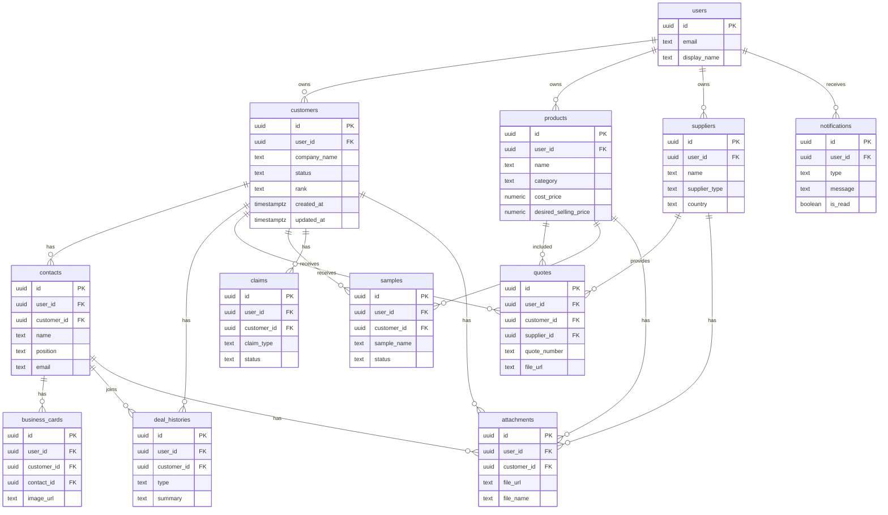

# DATABASE

営業手帳で使用するデータベース構造を管理する。

今後テーブルを追加・変更する場合は、この `DATABASE.md` を正として更新する。

## テーブル一覧

- customers
- contacts
- business_cards
- products
- suppliers
- quotes
- samples
- deal_histories
- claims
- attachments
- notifications
- users

## ER図

## customers

- 目的: 取引先会社情報を管理する。
- 主キー: `id`
- 主要カラム: `user_id`, `company_name`, `formal_name`, `industry`, `area`, `address`, `phone`, `website`, `email`, `inquiry_url`, `status`, `rank`, `score`, `tags`, `company_note`, `next_follow_up_date`, `last_contact_date`, `is_do_not_contact`, `created_at`, `updated_at`
- 外部キー: `user_id -> users.id`
- 関連テーブル: `contacts`, `business_cards`, `deal_histories`, `quotes`, `samples`, `claims`, `attachments`, `notifications`
- Storage利用有無: なし
- RLS有無: あり。`auth.uid() = user_id`
- 検索対象項目: `company_name`, `formal_name`, `industry`, `area`, `address`, `phone`, `website`, `email`, `tags`, `company_note`
- 今後追加予定項目: `corporate_number`, `company_size`, `annual_sales`, `employee_count`, `decision_flow`, `credit_note`

## contacts

- 目的: 会社に紐づく担当者情報を管理する。
- 主キー: `id`
- 主要カラム: `user_id`, `customer_id`, `name`, `department`, `position`, `email`, `phone`, `mobile`, `has_decision_authority`, `position_score`, `memo`, `created_at`, `updated_at`
- 外部キー: `user_id -> users.id`, `customer_id -> customers.id`
- 関連テーブル: `customers`, `business_cards`, `deal_histories`, `quotes`, `samples`, `attachments`
- Storage利用有無: なし
- RLS有無: あり。`auth.uid() = user_id`
- 検索対象項目: `name`, `department`, `position`, `email`, `phone`, `mobile`, `memo`
- 今後追加予定項目: `line_id`, `preferred_contact_method`, `birthday`, `influence_level`

## business_cards

- 目的: 名刺画像とOCR結果を管理する。
- 主キー: `id`
- 主要カラム: `user_id`, `customer_id`, `contact_id`, `image_url`, `file_name`, `ocr_text`, `parsed_name`, `parsed_company`, `parsed_department`, `parsed_position`, `parsed_email`, `parsed_phone`, `created_at`, `updated_at`
- 外部キー: `user_id -> users.id`, `customer_id -> customers.id`, `contact_id -> contacts.id`
- 関連テーブル: `customers`, `contacts`, `attachments`
- Storage利用有無: あり。名刺画像をSupabase Storageに保存する。
- RLS有無: あり。`auth.uid() = user_id`
- 検索対象項目: `ocr_text`, `parsed_name`, `parsed_company`, `parsed_department`, `parsed_position`, `parsed_email`, `parsed_phone`
- 今後追加予定項目: `ocr_provider`, `ocr_confidence`, `reviewed_at`, `reviewed_by`

## products

- 目的: 商品マスターを管理する。
- 主キー: `id`
- 主要カラム: `user_id`, `name`, `category`, `manufacturer_name`, `origin`, `temperature_zone`, `package_style`, `cost_price`, `cost_unit`, `desired_selling_price`, `selling_price_unit`, `gross_margin_rate`, `description`, `memo`, `image_url`, `product_material_url`, `spec_sheet_url`, `tags`, `created_at`, `updated_at`
- 外部キー: `user_id -> users.id`
- 関連テーブル: `quotes`, `samples`, `attachments`
- Storage利用有無: あり。商品画像、商品資料、スペックシートをSupabase Storageに保存する。
- RLS有無: あり。`auth.uid() = user_id`
- 検索対象項目: `name`, `category`, `manufacturer_name`, `origin`, `temperature_zone`, `package_style`, `description`, `memo`, `tags`
- 今後追加予定項目: `jan_code`, `allergen_info`, `shelf_life`, `inventory_link_id`, `supplier_product_code`

## suppliers

- 目的: 国内仕入先と海外メーカー情報を管理する。
- 主キー: `id`
- 主要カラム: `user_id`, `name`, `country`, `supplier_type`, `contact_person`, `email`, `phone`, `website`, `products`, `incoterms`, `loading_port`, `currency`, `moq`, `lead_time`, `payment_terms`, `temperature_zone`, `tags`, `memo`, `created_at`, `updated_at`
- 外部キー: `user_id -> users.id`
- 関連テーブル: `quotes`, `products`, `attachments`
- Storage利用有無: なし
- RLS有無: あり。`auth.uid() = user_id`
- 検索対象項目: `name`, `country`, `supplier_type`, `contact_person`, `email`, `phone`, `website`, `products`, `incoterms`, `loading_port`, `currency`, `memo`, `tags`
- 今後追加予定項目: `factory_certifications`, `export_license`, `lead_time_note`, `quality_contact`, `sample_policy`

## quotes

- 目的: 顧客への見積履歴と関連ファイルを管理する。
- 主キー: `id`
- 主要カラム: `user_id`, `customer_id`, `supplier_id`, `product_ids`, `contact_ids`, `quote_number`, `submitted_date`, `valid_until`, `currency`, `total_amount`, `gross_margin_rate`, `status`, `file_url`, `file_name`, `memo`, `lost_reason`, `created_by`, `created_by_name`, `created_at`, `updated_at`
- 外部キー: `user_id -> users.id`, `customer_id -> customers.id`, `supplier_id -> suppliers.id`
- 関連テーブル: `customers`, `suppliers`, `products`, `contacts`, `attachments`, `notifications`
- Storage利用有無: あり。見積PDFや関連資料をSupabase Storageに保存する。
- RLS有無: あり。`auth.uid() = user_id`
- 検索対象項目: `quote_number`, `status`, `file_name`, `memo`, `lost_reason`, `created_by_name`
- 今後追加予定項目: `approval_status`, `approved_by`, `sent_at`, `mail_log_id`, `revision_number`

## samples

- 目的: サンプル発送、到着、評価、採用状況を管理する。
- 主キー: `id`
- 主要カラム: `user_id`, `customer_id`, `contact_ids`, `product_ids`, `sample_name`, `shipped_date`, `arrival_date`, `follow_up_date`, `status`, `feedback`, `next_action`, `shipping_method`, `tracking_number`, `memo`, `created_by`, `created_by_name`, `created_at`, `updated_at`
- 外部キー: `user_id -> users.id`, `customer_id -> customers.id`
- 関連テーブル: `customers`, `contacts`, `products`, `notifications`, `attachments`
- Storage利用有無: なし。必要に応じて関連資料は `attachments` で管理する。
- RLS有無: あり。`auth.uid() = user_id`
- 検索対象項目: `sample_name`, `status`, `feedback`, `next_action`, `shipping_method`, `tracking_number`, `memo`, `created_by_name`
- 今後追加予定項目: `temperature_condition`, `delivery_company`, `adoption_id`, `sample_cost`, `sample_quantity`

## deal_histories

- 目的: 商談履歴を監査ログとして管理する。
- 主キー: `id`
- 主要カラム: `user_id`, `customer_id`, `contact_ids`, `date`, `type`, `summary`, `next_action`, `created_by`, `created_by_name`, `companion_users`, `companion_names`, `replies`, `has_claim`, `created_at`, `updated_at`
- 外部キー: `user_id -> users.id`, `customer_id -> customers.id`
- 関連テーブル: `customers`, `contacts`, `quotes`, `samples`, `claims`, `attachments`
- Storage利用有無: なし。音声や資料は `attachments` で管理する。
- RLS有無: あり。`auth.uid() = user_id`
- 検索対象項目: `type`, `summary`, `next_action`, `created_by_name`, `companion_names`, `replies`
- 今後追加予定項目: `meeting_start_at`, `meeting_end_at`, `location`, `voice_file_url`, `ai_minutes_id`

## claims

- 目的: クレーム履歴と対応状況を管理する。
- 主キー: `id`
- 主要カラム: `user_id`, `customer_id`, `contact_ids`, `claim_type`, `content`, `occurred_date`, `status`, `cause`, `prevention`, `due_date`, `resolved_date`, `created_by`, `created_by_name`, `created_at`, `updated_at`
- 外部キー: `user_id -> users.id`, `customer_id -> customers.id`
- 関連テーブル: `customers`, `contacts`, `deal_histories`, `attachments`, `notifications`
- Storage利用有無: なし。証跡画像や資料は `attachments` で管理する。
- RLS有無: あり。`auth.uid() = user_id`
- 検索対象項目: `claim_type`, `content`, `status`, `cause`, `prevention`, `created_by_name`
- 今後追加予定項目: `severity`, `internal_owner`, `supplier_id`, `quality_report_url`, `recurrence_risk`

## attachments

- 目的: 顧客、担当者、商品、仕入先、商談、見積、クレームに紐づくファイルメタ情報を管理する。
- 主キー: `id`
- 主要カラム: `user_id`, `customer_id`, `contact_id`, `product_id`, `supplier_id`, `quote_id`, `sample_id`, `deal_history_id`, `claim_id`, `file_url`, `file_name`, `file_type`, `file_size`, `storage_path`, `uploaded_by`, `uploaded_by_name`, `uploaded_at`, `created_at`, `updated_at`
- 外部キー: `user_id -> users.id`, `customer_id -> customers.id`, `contact_id -> contacts.id`, `product_id -> products.id`, `supplier_id -> suppliers.id`, `quote_id -> quotes.id`, `sample_id -> samples.id`, `deal_history_id -> deal_histories.id`, `claim_id -> claims.id`
- 関連テーブル: `customers`, `contacts`, `products`, `suppliers`, `quotes`, `samples`, `deal_histories`, `claims`
- Storage利用有無: あり。ファイル本体はSupabase Storage、DBにはURLとメタ情報のみ保存する。
- RLS有無: あり。`auth.uid() = user_id`
- 検索対象項目: `file_name`, `file_type`, `uploaded_by_name`
- 今後追加予定項目: `preview_url`, `thumbnail_url`, `checksum`, `retention_policy`, `virus_scan_status`

## notifications

- 目的: ホーム画面に表示する通知や未対応タスクを管理する。
- 主キー: `id`
- 主要カラム: `user_id`, `customer_id`, `related_table`, `related_id`, `type`, `title`, `message`, `due_date`, `priority`, `is_read`, `created_at`, `updated_at`
- 外部キー: `user_id -> users.id`, `customer_id -> customers.id`
- 関連テーブル: `customers`, `quotes`, `samples`, `claims`, `deal_histories`
- Storage利用有無: なし
- RLS有無: あり。`auth.uid() = user_id`
- 検索対象項目: `type`, `title`, `message`, `priority`
- 今後追加予定項目: `snoozed_until`, `action_url`, `resolved_at`, `resolved_by`

## users

- 目的: Supabase Authユーザーに紐づくアプリ内プロフィールを管理する。
- 主キー: `id`
- 主要カラム: `id`, `email`, `display_name`, `avatar_url`, `role`, `created_at`, `updated_at`
- 外部キー: `id -> auth.users.id`
- 関連テーブル: `customers`, `contacts`, `business_cards`, `products`, `suppliers`, `quotes`, `samples`, `deal_histories`, `claims`, `attachments`, `notifications`
- Storage利用有無: あり。プロフィール画像を使用する場合のみSupabase Storageに保存する。
- RLS有無: あり。`auth.uid() = id`
- 検索対象項目: `email`, `display_name`, `role`
- 今後追加予定項目: `department`, `position`, `team_id`, `notification_settings`, `default_signature`

## 保存先

### Database

- 会社情報
- 担当者
- 商談
- 見積
- サンプル
- クレーム

### Storage

- 商品画像
- 名刺画像
- 見積PDF
- 音声
- 添付資料

## 今後追加予定テーブル

- mail_logs
- line_logs
- ai_logs
- calendar_events
- sales_reports
- inventory_links
